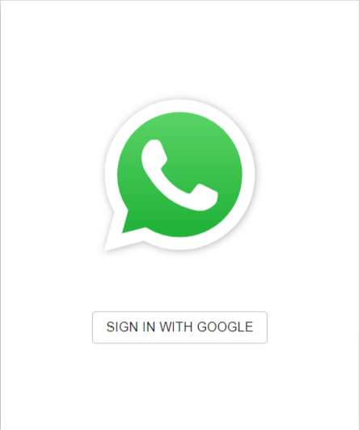

# Whatsapp clone


BELOW IS THE LINK TO APP

https://whatsapp-simple-clone.herokuapp.com/


## React Portfolio

- [Description](#Description)
- [Installations](#Installations)
- [Licence](#Licence)
- [Contributing](#Contributing)
- [User Story](#User-Story)
- [Acceptance Criteria](#Acceptance-Criteria)
- [Test](#Test)
- [Credits](#Credits)
- [Questions](#Questions)

## Description

WhatsApp clone, project is built on server-side rendering with Next.js, Styled Components, and Firebase.


## Installations

* Clone and `npm i`
* Set your .env.local file with the following configration found on firebase project
    *   ```API_KEY=you-api-key
            AUTH_DOMAIN=your-auth-domain
            PROJECT_ID=your-project-id
            STORAGE_BUCKET=your-storage-bucket
            MESSAGING_SENDER_ID=your-messaging-sender-id
            APP_ID=1:your-app-id```
## Contributing

none at this time

## Test

[](https://whatsapp-simple-clone.herokuapp.com/)

[live link](https://whatsapp-simple-clone.herokuapp.com/)

## Questions
email, or any other form of contact at my portfolio
<br>
-Email: [danielsoledad@gmail.com](mailto:danielsoledad@gmail.com)
<br>
-GitHub Username: [tuzosdaniel12](https://github.com/tuzosdaniel12) 
<br>
-Portfolio: [daniel-soledad.dev](https://daniel-soledad.dev) 


